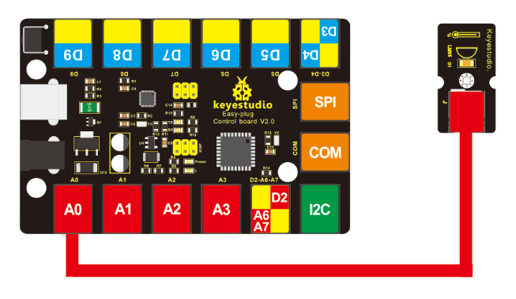

# KS0123 keyestudio EASY plug LM35 Temperature Sensor Module


## 1. Introduction

It is based on semiconductor LM35 temperature sensor.

A temperature sensor is exactly what it sounds like - a sensor used to measure ambient temperature.

It is effective in the range between 0 degree Celsius and 100 degree Celsius. Sensitivity is 10mV per degree Celsius.

The output voltage is proportional to the temperature. This module should be used together with EASY plug control board.

**Special Note:**

The sensor/module is equipped with the RJ11 6P6C interface, compatible with our keyestudio EASY plug Control Board with RJ11 6P6C interface.

If you have the control board of other brands, it is also equipped with the RJ11 6P6C interface but has different internal line sequence, can’t be used compatibly with our sensor/module.

## 2. Features

- Connector: Easy plug
- Power supply: 5V
- Sensitivity: 10mV per degree Celsius
- Function range: 0℃ to 100℃

## 3. Technical Details

- Dimensions: 38mm * 20mm * 18mm
- Weight: 4.6g

## 4. Connect It Up

Connect the EASY Plug LM35 temperature sensor to control board using an RJ11 cable. Then connect the control board to your PC with a USB cable.



## 5. Upload the Code

Download code:  [Code](./Code.7z)

```c
void setup()
{
	Serial.begin(9600);//Set Baud Rate to 9600 bps
}

void loop()
{
    int val;
    int dat;
    val=analogRead(0);//Connect LM35 on Analog 0
    dat=(500 * val) /1024;;
    Serial.print("Temp:"); //Display the temperature on Serial monitor
    Serial.print(dat);
    Serial.println("C");
    delay(500);
}
```

## 6. What You Should See

Done uploading the code, open the serial monitor and set the baud rate to 9600, you should see the analog temperature value.


